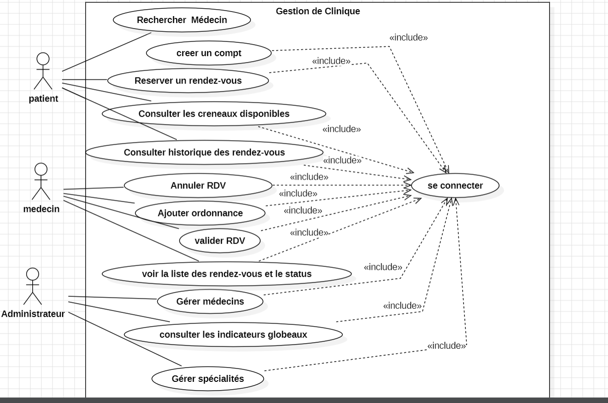
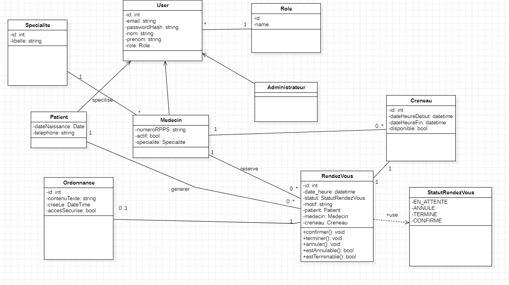
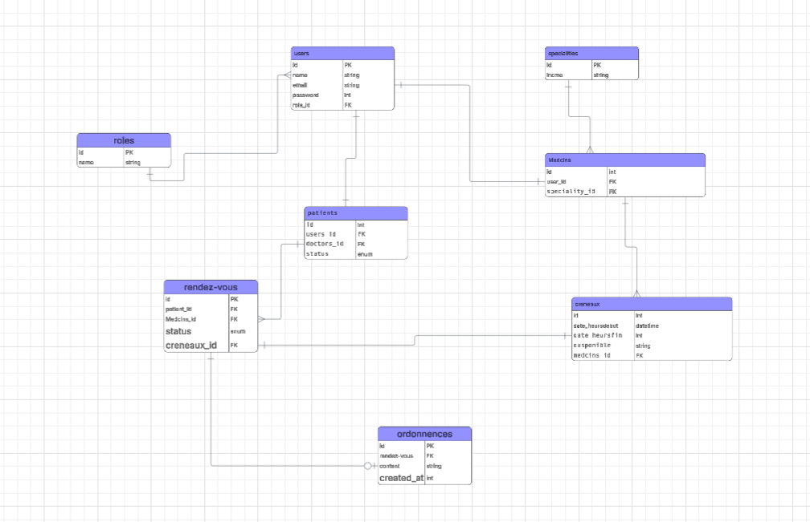

# MedFlow

# 🏥 MedFlow – Application de Gestion de Clinique Médicale

## 📌 Description du Projet

**MedFlow** est une plateforme web simplifiée de gestion de clinique médicale inspirée de Doctolib.

L’objectif principal est :

- Optimiser la prise de rendez-vous
- Fluidifier la gestion des plannings des médecins
- Offrir un suivi clair du cycle de vie des consultations
- Sécuriser l’accès via un système **RBAC (Role-Based Access Control)**

Chaque utilisateur possède un rôle unique qui détermine ses permissions dans l’application.

---

# 🚀 Fonctionnalités

## 👤 Espace Patient

### 🔍 Recherche Médecin

Le patient peut :

- Rechercher un médecin par nom
- Filtrer par spécialité
- Consulter les créneaux disponibles

### 📅 Réservation de Rendez-vous

Le patient connecté peut :

- Réserver un créneau libre
- Planifier une consultation

**Règles :**

- Statut initial : `EN_ATTENTE`
- Le créneau devient indisponible après réservation

### 📋 Tableau de Bord Patient

Le patient peut :

- Consulter ses rendez-vous passés
- Voir ses rendez-vous futurs
- Télécharger ses ordonnances

---

## 👨‍⚕️ Espace Médecin

### 📆 Gestion du Planning

Le médecin peut :

- Visualiser son agenda
- Consulter les rendez-vous de la semaine
- Distinguer les statuts via des couleurs

### ✅ Validation / ❌ Annulation

Le médecin peut :

- Valider un rendez-vous
  → `CONFIRME`

- Annuler un rendez-vous
  → `ANNULE`

Lors d’une annulation :

- Le créneau est immédiatement libéré

### 🩺 Consultation & Ordonnance

Pendant une consultation :

- Passage du rendez-vous à `TERMINE`
- Rédaction d’une ordonnance textuelle
- Archivage sécurisé du dossier patient

---

## 🛠️ Espace Administration

### 👨‍⚕️ Gestion des Médecins

L’administrateur peut :

- Créer un médecin
- Modifier un compte
- Désactiver un compte

Chaque médecin doit être associé à une spécialité.

### 🏥 Gestion des Spécialités

L’administrateur peut :

- Ajouter
- Modifier
- Supprimer les spécialités médicales

### 📊 Dashboard & Statistiques

L’administrateur peut consulter :

- Taux d’annulation
- Nombre de rendez-vous terminés
- Activité globale de la clinique

---

# 🔐 Sécurité & RBAC

L’application repose sur un système :

**RBAC – Role Based Access Control**

### Rôles disponibles

- ADMIN
- DOCTOR
- PATIENT

L’accès aux routes est protégé via :

- Middleware
- Vérification des permissions
- Contrôle des rôles

---

# 🔄 Cycle de Vie du Rendez-vous

Le rendez-vous suit un cycle strict :

```text
EN_ATTENTE
    ↓
CONFIRME
    ↓
TERMINE

ou

EN_ATTENTE
    ↓
ANNULE
```

Le typage strict empêche les transitions invalides.

Exemple :

❌ Un rendez-vous annulé ne peut pas devenir terminé.

---

# 🧱 Architecture du Projet

```bash
medflow/
├── config/
│   ├── database.php
│   └── security.php
│
├── public/
│   ├── css/
│   ├── js/
│   └── index.php
│
├── src/
│   ├── Controller/
│   ├── Entity/
│   ├── Enum/
│   ├── Middleware/
│   └── Repository/
│
├── templates/
│   ├── admin/
│   ├── doctor/
│   ├── patient/
│   ├── auth/
│   └── layout/
│
├── .env
└── README.md
```

---

# 🗃️ Modélisation UML

## Use Case Diagram

Ajouter ici le diagramme de cas d’utilisation.

```md

```

---

## Class Diagram

Ajouter ici le diagramme de classe.

```md

```

---

## ERD – Entity Relationship Diagram

Ajouter ici l’ERD.

```md

```

---

# ⚙️ Technologies Utilisées

### Backend

- PHP 8
- PDO
- MySQL

### Frontend

- HTML5
- CSS3
- JavaScript
- Tailwind CSS / Bootstrap

### Outils

- Git & GitHub
- Jira
- Canva
- PlantUML

---

# 📅 Organisation du Projet

## Gestion des tâches

JIRA :

```text
Ajouter le lien JIRA ici
```

## Repository GitHub

```text
Ajouter le lien GitHub ici
```

---

# 👥 Travail en Groupe

Projet réalisé en équipe.

Répartition des tâches :

- Analyse & UML
- Backend
- Frontend
- Base de données
- Documentation

---

# 🎯 Critères de Performance

### Architecture & Modélisation

✔ Gestion des rôles
✔ Middleware sécurisé
✔ Architecture claire

### Typage Strict

✔ Gestion contrôlée du cycle de vie des rendez-vous
✔ États sécurisés

### Qualité du Code

✔ Commits clairs
✔ Structure MVC
✔ Documentation README

---

# 🧪 Installation

## 1. Cloner le projet

```bash
git clone <repo-url>
```

## 2. Configurer .env

Ajouter :

```env
DB_HOST=
DB_NAME=
DB_USER=
DB_PASS=
```

## 3. Lancer le serveur

```bash
php -S localhost:8000 -t public
```

---

# 📚 Référentiel

**Développeur Web et Web Mobile – 2023**

---

# 👨‍💻 Auteur / Équipe

Projet réalisé dans le cadre du brief :

**MedFlow – Application de Gestion de Clinique Médicale**
